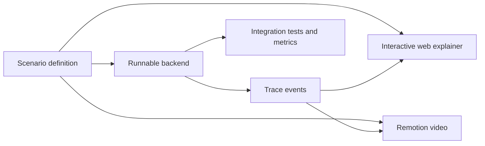

# Backend Systems Visual Lab

Runnable failure scenarios, interactive traces, and code-driven videos for senior and principal backend engineering.

This repository does not teach patterns as isolated definitions. Each lab starts with a plausible implementation, breaks it under controlled conditions, and makes the engineering tradeoff visible.

## The teaching model

Every lab follows the same contract:

1. **Naive implementation** — the version that looks correct in a code review.
2. **Failure injection** — concurrency, partial failure, delay, duplication, or overload.
3. **Visual trace** — requests, transactions, events, retries, and state changes on one timeline.
4. **Production-grade options** — more than one valid fix when the tradeoff matters.
5. **Cost of the fix** — latency, complexity, coupling, storage, and operational burden.
6. **Evidence** — integration tests, invariants, metrics, and benchmark results.

## One scenario, three outputs



The scenario definition and trace protocol are the source of truth. The web explainer and video must visualize real system behavior instead of reproducing it manually.

## First lab: duplicate payment

**Question:** What happens when a user clicks “Pay” twice?

The lab will run two concurrent requests in three modes:

| Mode | Mechanism | Expected result | Tradeoff exposed |
| --- | --- | --- | --- |
| Unprotected | No duplicate protection | Two payment attempts are possible | The happy path is not a correctness proof |
| Database constraint | Unique business key | One write survives | The loser still needs a stable API response |
| Idempotency | Key, request hash, and response replay | One effect, repeatable response | Key lifecycle and storage now matter |

See [`labs/01-duplicate-payment`](labs/01-duplicate-payment/README.md).

## Roadmap

| Lab | Failure being visualized | Engineering decision |
| --- | --- | --- |
| 01 — Duplicate payment | Concurrent duplicate requests | Idempotency boundary |
| 02 — Overselling | Two buyers, one remaining item | Locking and optimistic concurrency |
| 03 — Lost event | Database commit succeeds, publish fails | Transactional outbox |
| 04 — Retry storm | A dependency fails at scale | Backoff, jitter, DLQ, and backpressure |
| 05 — Cache stampede | A hot key expires | Request coalescing and stale data |
| 06 — Overload | Arrival rate exceeds service capacity | Admission control and load shedding |
| 07 — Schema migration | Old and new versions run together | Expand-and-contract migration |
| 08 — Service extraction | A module becomes an organizational bottleneck | Boundary and migration strategy |
| 09 — Reliability budget | Reliability target conflicts with cost | SLO, capacity, and cost decisions |

The detailed sequence and kill criteria are in [`ROADMAP.md`](ROADMAP.md).

## Repository structure

```text
apps/
  api/                 real system behavior and trace emission
  web/                 interactive step-through visualization
  video/               Remotion compositions and exports
packages/
  scenario-schema/     shared scenario contract
labs/
  01-duplicate-payment/
docs/
  adr/                 architecture decision records
infra/                 local dependencies and failure controls
```

## Why one repository

The labs share a scenario schema, trace protocol, visual language, test harness, and release process. Splitting them now would multiply maintenance without creating a useful boundary.

A lab should become a separate repository only when it has at least one of these properties:

- an independent release lifecycle;
- a runtime or infrastructure model that cannot share the toolchain;
- a contributor community that needs separate ownership;
- a reusable product surface beyond this curriculum.

The decision is recorded in [`ADR-0001`](docs/adr/0001-monorepo.md).

## Current status

The curriculum, repository boundaries, and first scenario contract are defined. The first implementation target is the duplicate-payment lab.

## License

[MIT](LICENSE)
