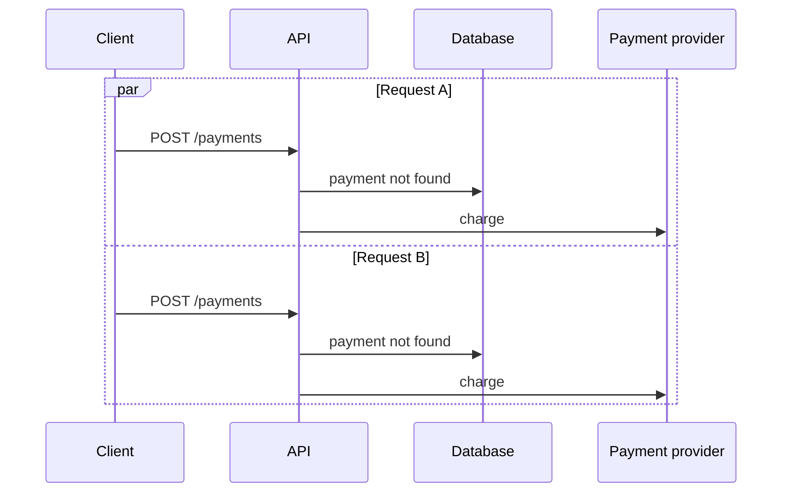

# Lab 01: Duplicate payment

## Question

What happens when two requests represent the same payment intent?

## Invariant

One payment intent must create at most one external charge.

## Why this fails

Two requests can pass an application-level “does this payment exist?” check before either transaction commits. A fast local test hides the race because the requests do not overlap at the critical point.

## Modes

### A. Unprotected

- No idempotency key
- No unique business constraint
- Expected failure: two charge attempts

### B. Database constraint

- Unique constraint on payment intent
- Expected result: one persisted payment
- Remaining problem: the losing request needs a deliberate response contract

### C. Idempotent API

- Client supplies an idempotency key
- Server stores the request fingerprint and final response
- Same key plus same request replays the response
- Same key plus different request is rejected

## Experiment design

1. Hold both requests at a concurrency barrier.
2. Release both into the critical section.
3. Record request, transaction, constraint, and provider events.
4. Repeat each mode enough times to expose nondeterministic behavior.
5. Assert the business invariant, not only HTTP status codes.

## Visual output

The interactive view and Remotion composition must show:

- two request lanes;
- the exact overlap window;
- transaction begin and commit;
- provider charge attempts;
- the invariant result;
- latency added by the selected protection.

## Evidence required

- Integration test against a real database
- Provider fake that counts charge attempts
- Trace generated from runtime events
- Comparison of all three modes
- Decision record covering key scope, TTL, and response replay

## Status

Scenario contract defined. Runtime implementation not started.
